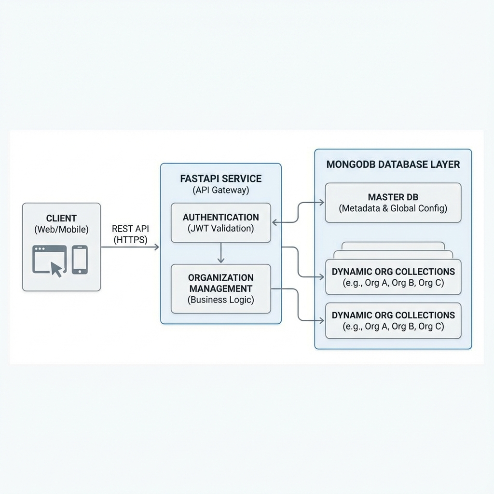

# Design Notes

## Architecture Overview

The Organization Management Service is built using **FastAPI** (Python 3.10+) and **MongoDB** (Motor for async driver). It follows a multi-tenant style architecture where each organization has its own logical data separation via dynamic collections.

### High Level Diagram

## Design Choices

### 1. Database - MongoDB
**Why:** MongoDB is flexible and schema-less, making it ideal for dynamic collection creation requested in the prompt.
**Implementation:**
- **Master Database (`master_db`)**: Stores global metadata (`Organization`, `Admin`) to manage tenants.
- **Dynamic Collections**: Each organization gets a collection named `org_<org_name>`. This ensures data isolation at the collection level while keeping the implementation simple within a single Mongo instance (or cluster).

### 2. Framework - FastAPI
**Why:** Verification of "Python framework" requirement. FastAPI provides high performance (async), automatic OpenAPI documentation, and easy dependency injection for authentication.

### 3. Authentication - JWT
**Why:** Stateless authentication is scalable. Admins receive a JWT upon login which carries their identity and organization scope.

### 4. Organization update (Rename) Logic
Updating an organization name is non-trivial in a collection-per-tenant model because the collection name depends on the organization name.
**Trade-off:** I implemented a `renameCollection` mechanism. This is an expensive operation in MongoDB if data is large.
**Alternative:** Use an immutable `org_id` for collection names (e.g., `org_uuid`). The Organization Name would just be a metadata field. I chose the simpler `org_<name>` pattern as strictly requested by the examples ("Example collection name pattern: org_<organization_name>"), but in production, UUIDs are safer to avoid rename complexity.

## Scalability & Trade-offs
- **Pros:** Logic separation is clear. Easy to scale the service layer.
- **Cons:**
    - **Collection Count:** MongoDB has limits on the number of collections (namespace files). A collection-per-tenant model works for thousands of tenants but might hit limits at very high scale (e.g. 100k+ tenants).
    - **Connection Management:** Single `AsyncIOMotorClient` is efficient, but if we strictly had separate DBs per tenant, connection pooling would become a bottleneck.
- **Better Approach for High Scale:**
    - Usage of `org_id` in every document (Index on `org_id`) in a shared `Collections` approach (Sharding).
    - Or Database-per-tenant if strict isolation is needed (but more resource intensive).
